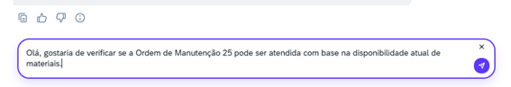
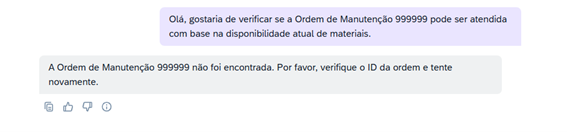
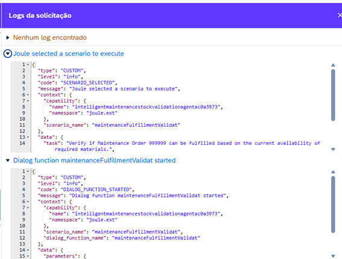

#Iremos testar o agente em um ambiente Joule compartilhado

## 1 - Acessar o chat do Joule através do link abaixo e enviar perguntas relacionadas as habilidades e pressione enviar.

Chat Joule: https://sap-build-us10-trial-5-sd5tu6nm.us10.sapdas.cloud.sap/webclient/standalone/da_basictrialshared

<B>Pergunta:</B> Olá, gostaria de verificar se a Ordem de Manutenção 25 pode ser atendida com base na disponibilidade atual de materiais.

Pressione o botão enviar.

 

Ele irá pensar por algum momento e irá retornar com o resultado.

### 2 - É possivel testar para alucinações, e perguntar sobre ordens que não existem.

<B> Pergunta:</B> Olá, gostaria de verificar se a Ordem de Manutenção 999999 pode ser atendida com base na disponibilidade atual de materiais.

 

### 3 - Também é possivel debugar o .xml do retorno recebido para avaliar se o resultado está correto. 

Necessário clicar no botão depurar.

Exemplo de .xml

 

# [Voltar](../README.md)
