# Pré Requisito - Criar Conta Trial

## 1 - Primeiro passo será criar uma conta trial com validade de 30 dias.

Link Trial SAP Build: <https://www.sap.com/products/technology-platform/build/trial.html>

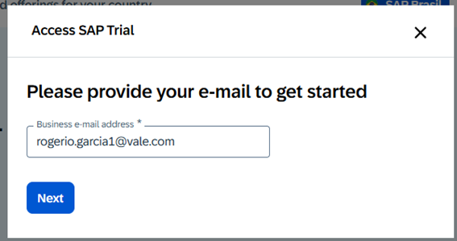

Irá receber usuário e palavra-chave no corpo do Email

Remetente: [webmaster@sap.com](mailto:webmaster@sap.com)

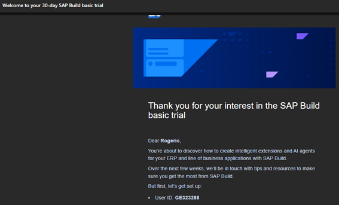 

## 2 - No e-mail recebido será informado usuário e senha a ser utilizado para logarmos no SAP Build e no Joule Studio.

Link SAP Build: <https://sap-build-us10-trial-3-t67lhj9w.us10.build.cloud.sap/lobby>

## 3 - Iniciar o processo de criação de um projeto. Clicar no botão 'Criar' e escolher 'Criar um agente e habilidade' do Joule

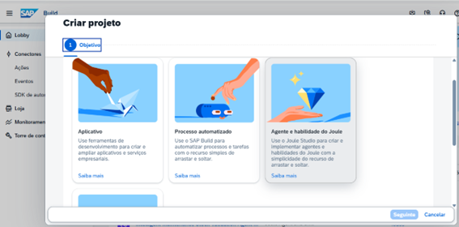

<B>Nome:</B> Agente de validacao do estoque da manutencao -#SEUUSUARIO (GE323288)

<B>Descrição:</B> Este projeto contém um agente Joule e habilidades usadas para validar ordens de manutenção com base na disponibilidade de materiais.

## 4 - Acessar o agente criado, após ir no botão ‘Criar’ e ‘Habilidade do Joule’

 

## 5 - Preencher os campos conforme abaixo e pressionar em ‘Criar’
<B>Nome:</B> ObterDetalhesOrdemManutencao

<B>Descrição:</B> Exibir informações da ordem de manutenção, como status, prioridade, localização e datas.
Criar habilidade.
 Ao ser criada, acessar a opção ‘Painel de habilidades’
 

Acessar a aba parâmetros e clicar no símbolo + na sessão ‘Entrada da habilidade’
 
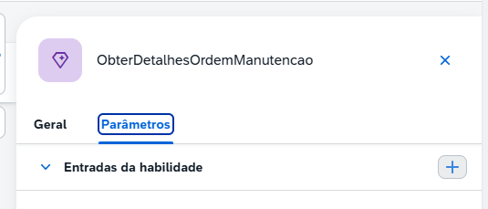

## 6 - Preencher os campos com os seguintes conteúdos e pressionar ‘Aplicar’.
<B>Nome:</B> ID Ordem manutencao

<B>Descrição:</B> ID da ordem de manutenção para obter informações sobre a manutenção
Obrigatório: Sim

Clicar em ‘Salvar’

## 7 - Na aba parâmetros, clicar no símbolo + na sessão ‘Saídas da habilidade’
 
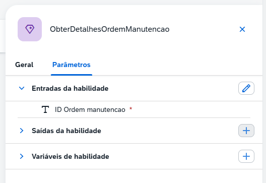

<B>Nome:</B> Detalhes ordem de manutencao

<B>Descrição:</B> Detalhes ordem de manutenção

<B>Tipo:</B> Any 

<B>Obrigatório:</B> Sim
 
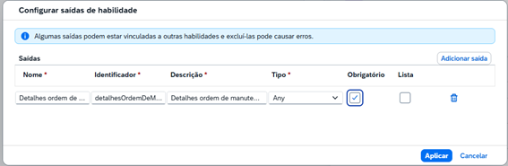

## 8 - Clicar no botão ‘Adicionar etapa’ e escolher a opção ‘Call Action’ e ‘Browse All Actions’

 

Na biblioteca ‘Mostrar filtros’

<B>Projeto:</B> Maintenance Fulfillment Agent API

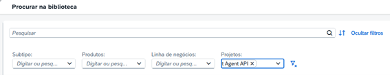

<B>Nome:</B> Get maintenance order details

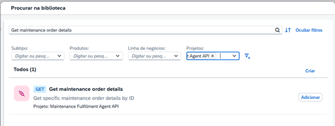

## 9 - Após adicionar, necessário criar uma ‘Variável de destino’
 
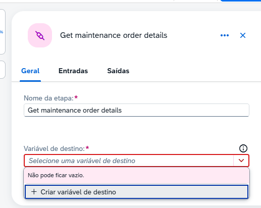

<B>Identificador:</B> AgenteDeAtendimento

<B>Descrição:</B> Destination do agente de atendimento da manutenção

 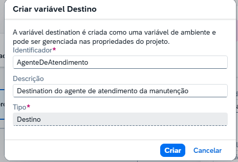

## 10 - Definir as entradas e as saídas.
 
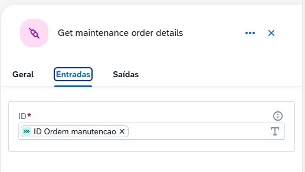 

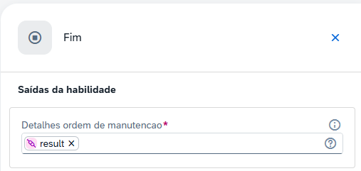

# [Voltar](../README.md)

