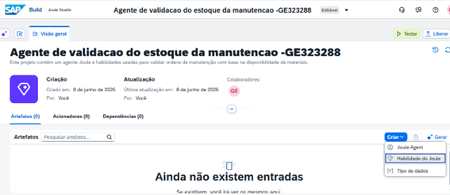
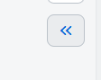
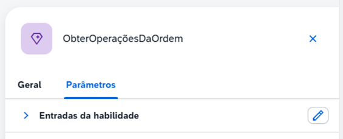
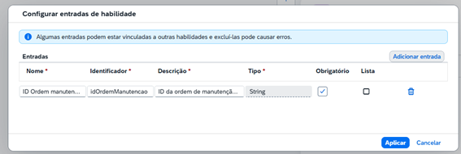
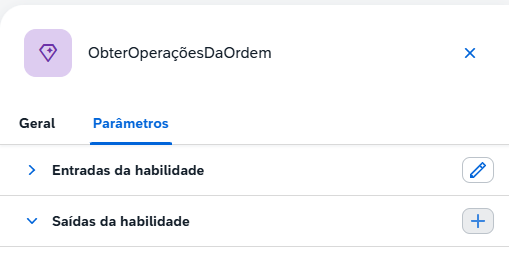
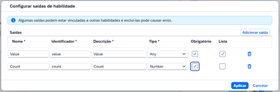
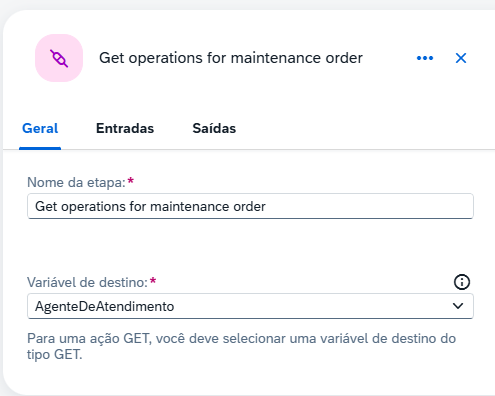
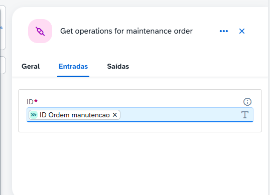

# Após finalizar o exercício 1.1. Salvar todo a trabalho realizado e retornar a tela inicial.

## 1 - Na tela inicial do Joule Studio
Acessar o agente criado, após ir no botão ‘Criar’ e ‘Habilidade do Joule’

## Preencher os campos conforme abaixo e pressionar em ‘Criar’
<B>Nome</B>: ObterOperaçõesDaOrdem

<B>Descrição:</B> Listar operações sob uma ordem específica.

Criar habilidade.
Ao ser criada, acessar a opção ‘Painel de habilidades’

Acessar a aba parâmetros e clicar no símbolo + na sessão ‘Entrada da habilidade’

## Preencher os campos com os seguintes conteúdos e pressionar ‘Aplicar’.
<B>Nome:</B> ID Ordem manutencao

<B>Descrição:</B> ID da ordem de manutenção para obter informações sobre a manutenção

<B>Obrigatório:</B> Sim

Clicar em ‘Aplicar’

## Na aba parâmetros, clicar no símbolo + na sessão ‘Saídas da habilidade’

<B>Saida 1</B>

<B>Nome:</B> Value

<B>Descrição</B>: Value

<B>Tipo:</B> Any 

<B>Obrigatório:</B> Sim

<B>Lista:</B> Sim 

<B>Saida 2</B>

<B>Nome:</B> Count

<B>Descrição:</B> Count

<B>Tipo:</B> Number 

<B>Obrigatório:</B> Sim

<B>Lista:</B> Não

## Clicar no botão ‘Adicionar etapa’ e escolher a opção ‘Call Action’ e ‘Browse All Actions’
 
Na biblioteca ‘Mostrar filtros’ e selecionar ‘Get operations for maintenance order’
Variável de destino: AgenteDeAtendimento

## Navegar até a aba de ‘Entradas’ e selecionar o ID.

## Selecionar o passo ‘Fim’ e definir os parâmetros de saída

 # [Voltar](../README.md)
